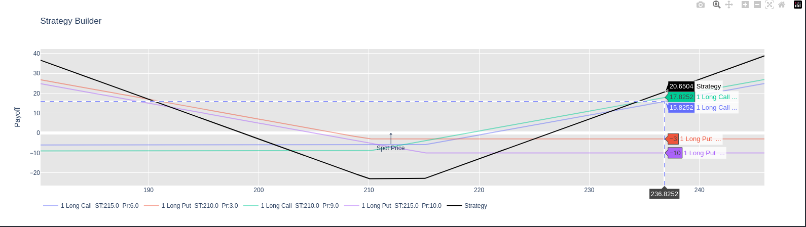
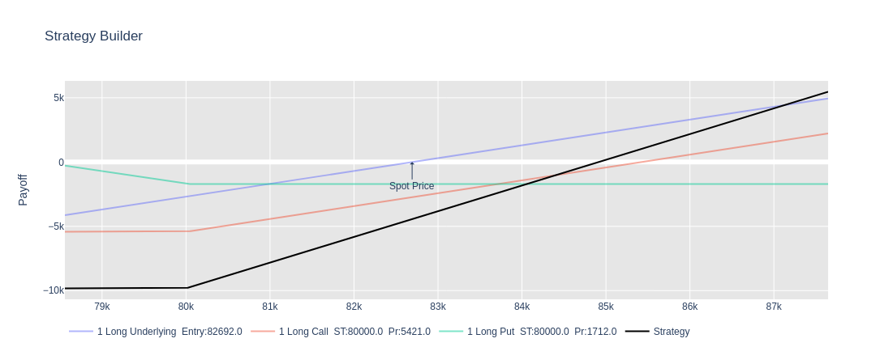
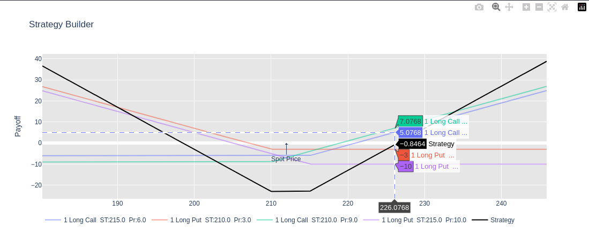

# Options `Strategy Builder` & Payoff Visualizer

A lightweight Python library for **building, combining, and visualizing option strategies and underlying positions**, with clean payoff diagrams rendered using Plotly.

This tool is designed for **quantitative developers, traders, and financial engineers** who want a fast and flexible way to analyze payoff profiles of multi-leg option strategies together with underlying assets.

---

## Features

* Support for **options (Call / Put)** and **underlying assets**
* Long and short positions
* Multiple contracts per leg
* Combination of options + underlying in a single strategy
* Clear visualization of:

  * Individual leg payoffs
  * Total strategy payoff
  * Spot price marker
* Interactive `Plotly` charts (zoom, hover, export)
* Minimal dependencies, no pricing models involved

---



---


## What This Library Is 

* Visualize **payoff at expiration**
* Combine multiple instruments in one strategy
* Focus on clarity and correctness of payoff logic


---

## Installation

Clone the repository and install dependencies:

```bash
pip install numpy plotly
```

Then place `StrategiesBuilder.py` (or your module name) in your project or Python path.

---

## Core Concepts

### Instruments

Two instruments are supported:

| Instrument   | Description                             |
| ------------ | --------------------------------------- |
| `option`     | European call or put option             |
| `underlying` | Spot asset (stock, index, crypto, etc.) |

---

### Trade Direction

| Trade   | Meaning             |
| ------- | ------------------- |
| `long`  | Buy the instrument  |
| `short` | Sell the instrument |

---

### Payoff Conventions

#### Option

* **Long option**:
  `payoff = intrinsic_value - premium`
* **Short option**:
  `payoff = -(intrinsic_value - premium)`

#### Underlying

* **Long**:
  `payoff = (price - entry)`
* **Short**:
  `payoff = -(price - entry)`

All payoffs are multiplied by `Contract`.

---

## Usage

### Import

```python
from StrategiesBuilder import Strategy_builder as SB
```

---

### Example 1: Underlying + Options Strategy

```python
Underlying = {'Instrument': 'underlying','Trade': 'long','Entry': 82692,'Contract': 1}

Action_1 = {'Instrument': 'option','Type': 'call','Strike': 80000,'Trade': 'long','Premium': 5421,'Contract': 1}
Action_2 = {'Instrument': 'option','Type': 'put','Strike': 80000,'Trade': 'long','Premium': 1712,'Contract': 1}

Strategy = [Underlying, Action_1, Action_2]

SB(
    spot=82692,
    spot_range=5,
    Strategy=Strategy
)
```

This example combines:

* A long underlying position
* A long call
* A long put
  Resulting in a **synthetic payoff structure**.



---

### Example 2: Pure Options Strategy

```python
Action_1 = {'Type': 'call', 'Strike': 215, 'Trade': 'long', 'Premium': 6}
Action_2 = {'Type': 'put',  'Strike': 210, 'Trade': 'long', 'Premium': 3}
Action_3 = {'Type': 'call', 'Strike': 210, 'Trade': 'long', 'Premium': 9}
Action_4 = {'Type': 'put',  'Strike': 215, 'Trade': 'long', 'Premium': 10}

Strategy = [Action_1, Action_2, Action_3, Action_4]

SB(
    spot=212,
    spot_range=15,
    Strategy=Strategy
)
```

This produces:

* Individual payoff curves per option leg
* A combined strategy payoff


---

## Function Reference

### `Strategy_builder(...)`

```python
Strategy_builder(
    spot: float,
    spot_range: int = 20,
    Strategy: list[dict] = None,
    save: bool = False,
    file: str = "fig.html"
)
```

#### Parameters

| Parameter    | Description                               |
| ------------ | ----------------------------------------- |
| `spot`       | Current spot price                        |
| `spot_range` | Percentage range around spot for plotting |
| `Strategy`   | List of strategy legs                     |

---

## Strategy Leg Schema

### Option Leg

```python
{
    'Instrument': 'option',
    'Type': 'call' | 'put',
    'Strike': float,
    'Premium': float,
    'Trade': 'long' | 'short',
    'Contract': int
}
```

### Underlying Leg

```python
{
    'Instrument': 'underlying',
    'Trade': 'long' | 'short',
    'Entry': float,
    'Contract': int
}
```

---

## Design Philosophy

* **Explicit is better than implicit**
* No hidden assumptions
* Deterministic payoff logic
* Separation of:

  * Validation
  * Payoff calculation
  * Visualization

This makes the code easy to:

* Audit
* Extend
* Embed in larger quant systems

---

## Roadmap (Optional)

Possible future extensions:

* Profit/Loss zones annotation
* Break-even detection
* Strategy presets (straddle, collar, box, etc.)
* Vectorized batch strategy evaluation
* Export to reports or dashboards

These are intentionally **not included yet** to keep the core clean.

---

## License

MIT License
Free to use, modify, and integrate into personal or commercial projects.


## 🚀 About Me
Quantitative Developer
>> linkedin : https://www.linkedin.com/in/sajad-taj/


## Credits / Attribution

This project was inspired by and initially based on the `opstrat` project by @hashabcd.

Upstream reference:
- https://github.com/hashabcd/opstrat